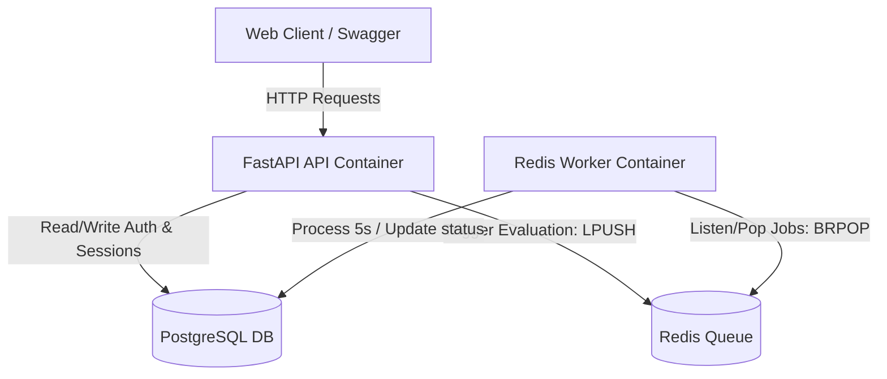

# Bodhrik Assessment — FastAPI Backend Service

A production-ready FastAPI backend scaffold built for a take-home software engineering assignment. This service models the core data relationships and workflows of a student-teacher-parent educational portal, featuring JWT authentication, role-based access control (RBAC), and a Redis background evaluation task queue.

---

## 🛠️ Tech Stack

| Component | Technology | Description |
| :--- | :--- | :--- |
| **Runtime** | Python 3.12 | Base Python interpreter |
| **Framework** | FastAPI | Async web framework for APIs |
| **ORM** | SQLAlchemy 2.0 | Async Python SQL toolkit |
| **Database** | PostgreSQL 16 | Relational database storage |
| **Cache & Queue** | Redis 7 | Job queue and key-value store |
| **Authentication** | JWT | JSON Web Tokens (using `python-jose` & direct `bcrypt`) |
| **Linting** | Ruff | Modern Python linter and formatter |
| **Testing** | Pytest | Async testing framework |
| **Containerization**| Docker & Compose | Multi-container environment orchestration |

---

## 📐 Architecture Flow



---

## 📂 Project Structure

```text
bodhrik-assessment/
├── .github/
│   └── workflows/
│       └── ci.yml            # GitHub Actions CI lint & test runner
├── alembic/                  # Alembic DB migration environment
│   ├── env.py                # Database connection script for migrations
│   └── script.py.mako        # Migration code template
├── app/                      # Application core package
│   ├── api/                  # API endpoints and dependency handlers
│   │   ├── deps.py           # JWT and RBAC dependency checks
│   │   └── v1/
│   │       ├── endpoints/
│   │       │   ├── auth.py   # Register & Login endpoints
│   │       │   ├── sessions.py # CRUD Sessions endpoints with RBAC
│   │       │   └── evaluations.py # Evaluation trigger endpoint
│   │       └── router.py     # Aggregated v1 endpoints router
│   ├── core/                 # App configurations and constants
│   │   ├── config.py         # Settings class (Pydantic Settings)
│   │   ├── redis.py          # Redis connection pool and FIFO queue
│   │   └── security.py       # Password hashing & JWT helper utilities
│   ├── db/                   # Database session and base configuration
│   │   ├── database.py       # Engine, SessionLocal, Base declarations
│   │   ├── base.py           # Exports Base metadata mapping
│   │   └── session.py        # Yields DB session dependency injection
│   ├── models/               # SQLAlchemy declarative mapping schemas
│   │   ├── user.py           # User model (admin, teacher, parent, student)
│   │   ├── session.py        # Session model (linked to teacher/student)
│   │   ├── evaluation.py     # Evaluation model (Linked to session)
│   │   └── parent_student.py # Parent-Student relationship mapping
│   ├── schemas/              # Pydantic data validation schemas
│   │   ├── user.py           # User validators and response wrappers
│   │   ├── session.py        # Session payload & listing models
│   │   └── evaluation.py     # Evaluation validation and response models
│   └── main.py               # Main FastAPI initialization & health route
├── tests/                    # Testing suite
│   ├── conftest.py           # Fixture declarations (async HTTPX client)
│   ├── test_auth.py          # Registration & Login endpoints verification
│   ├── test_sessions.py      # Session CRUD & RBAC checks
│   ├── test_evaluations.py   # Queue triggers tests
│   └── test_health.py        # Health API check
├── Dockerfile                # API & Worker service image definition
├── docker-compose.yml        # Multi-container local execution setup
├── requirements.txt          # Root Python dependencies
├── pyproject.toml            # Ruff linter and Pytest settings
├── alembic.ini               # Alembic configuration variables
├── README.md                 # Project README documentation
└── DESIGN_NOTE.md            # Structural choices, RBAC extensions & prod safety analysis
```

---

## ⚙️ Environment Variables

Copy the variables template to configure local variables:
```bash
cp .env.example .env
```

Key variables configured inside [.env](file:///c:/Users/Dell/OneDrive/Desktop/bodhrik-assessment/.env):

| Name | Default Value | Description |
| :--- | :--- | :--- |
| `DATABASE_URL` | `postgresql+asyncpg://postgres:postgres@db:5432/bodhrik` | Async connection string for PostgreSQL |
| `REDIS_URL` | `redis://redis:6379/0` | Connection string for Redis |
| `JWT_SECRET_KEY` | `change-me-in-production` | Secret phrase utilized to sign tokens |
| `JWT_ALGORITHM` | `HS256` | Token hashing algorithm |
| `ACCESS_TOKEN_EXPIRE_MINUTES`| `30` | Access token lifespan duration |

---

## 🚀 Running the Project

### Option 1: Docker Compose (Recommended)

Spins up the full stack: FastAPI server, PostgreSQL Database, Redis Cache, and the background task Worker.

```bash
# Build and run the containers in the foreground
docker compose up --build

# Run in detached mode (background)
docker compose up -d --build
```

Access links:
*   **Swagger API Docs**: [http://localhost:8000/docs](http://localhost:8000/docs)
*   **Health Check API**: [http://localhost:8000/health](http://localhost:8000/health)

### Option 2: Local Development

1.  **Create and activate a virtual environment**:
    ```bash
    python -m venv .venv
    # Windows:
    .\.venv\Scripts\activate
    # macOS/Linux:
    source .venv/bin/activate
    ```
2.  **Install dependencies**:
    ```bash
    pip install -r requirements.txt
    ```
3.  **Start your local PostgreSQL and Redis servers**, update `.env` connection strings, and run:
    ```bash
    uvicorn app.main:app --reload
    ```

To run the background task worker locally:
```bash
python worker.py
```

---

## 🚦 Testing & Linting

### Linting Checks
Perform static analysis checks using **Ruff**:
```bash
ruff check .
```

### Running Tests
Execute the unit and integration tests using **Pytest** (run in asynchronous mode, with mock database layers):
```bash
pytest
```

---

## 📡 API Endpoints

### 🔑 Authentication
*   `POST /api/v1/auth/register`: Register a user. Body takes `name`, `email`, `password`, and `role` (`admin`, `teacher`, `parent`, or `student`).
*   `POST /api/v1/auth/login`: Authenticate credentials (OAuth2 Form) and retrieve a JWT token.

### 📅 Sessions (CRUD with RBAC)
*   `POST /api/v1/sessions/`: Create session. Restricts teachers to only scheduling themselves.
*   `GET /api/v1/sessions/`: List visible sessions.
    *   **Teachers** see sessions they teach.
    *   **Students** see sessions they attend.
    *   **Parents** see sessions belonging to their children.
    *   **Admins** see all sessions.
*   `GET /api/v1/sessions/{session_id}`: Retrieve session details. Validates role and object-level permissions.
*   `PUT /api/v1/sessions/{session_id}`: Update session values. Teachers cannot reassign other teachers.
*   `DELETE /api/v1/sessions/{session_id}`: Delete session. Limited to admins and session teachers.

### 🚀 Evaluations
*   `POST /api/v1/evaluations/trigger/{session_id}`: Trigger session evaluation. Checks session ownership, writes a `Pending` Evaluation row in PostgreSQL, and enqueues the `session_id` into the Redis queue.

---

## ⚙️ Redis Queue & Background Worker Details

1.  **Queue Publisher**: When `/evaluations/trigger/{session_id}` is requested, the system verifies permissions, logs a `Pending` status in the DB, and enqueues the job via `LPUSH` into the Redis list `evaluation_jobs`.
2.  **Worker Process**: The background `worker.py` client runs an infinite loop using `BRPOP` (Blocking Right Pop) against the list. It blocks efficiently without CPU polling.
3.  **Processing**: When popped, the worker sleeps for 5 seconds (simulating model evaluation) and updates the status column in the `evaluations` table to `Completed`.
